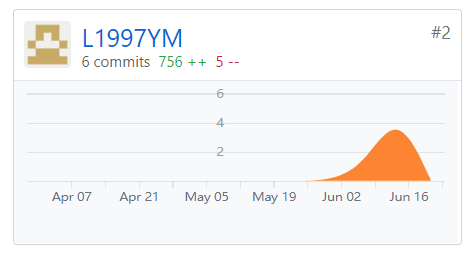
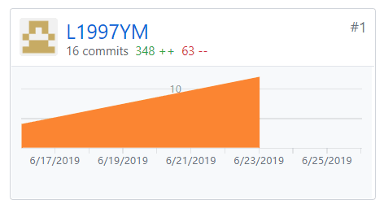

## 个人小结
   这是一次非常珍贵的团队协作经历，以及一个产品如何从产品设计到代码实现的完整过程的体验，

## PSP2.1统计表

## 主要工作清单

前端开发：问卷统计页面、关于页面、修改信息页面

文档编辑：产品特性、用例图、用例设计、代码规范、部署报告、第一次迭代会议记录、第五次迭代会议记录

## 个人GIT总结
* 代码仓库贡献

* 文档仓库贡献

## 个人博客清单
+ [微信小程序云开发：数据库操作](https://blog.csdn.net/Lyn_B/article/details/93533339)
+ [微信小程序云开发：项目创建与云开发控制台](https://blog.csdn.net/Lyn_B/article/details/93480900)

## 特别致谢
感谢每个人一直以来的努力
